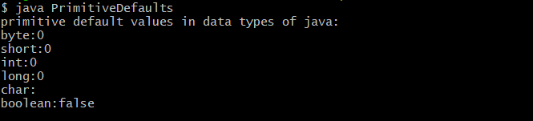
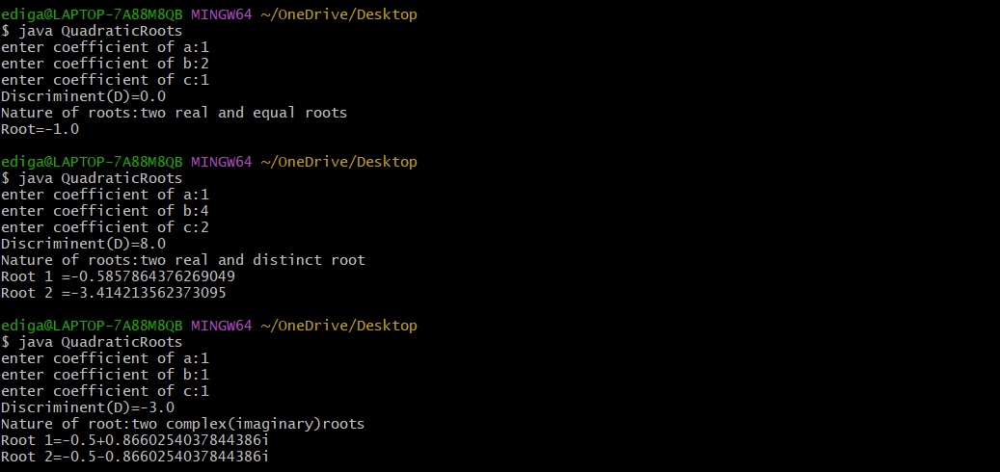

# Experieent 1
## Title : Diplay Primitive Datatypes values
```java
class DefaultValues {
   byte b;
   short s;
   int i;
   float f;
   long l;
   char c;
   boolean bool;
}
public class PrimitiveDefaults {
   public static void main(String[] args) {
      DefaultValues obj=new DefaultValues();
      System.out.println("primitive default values in data types of java:");
      System.out.println("byte:"+obj.b);
      System.out.println("short:"+obj.s);
      System.out.println("int:"+obj.i);
      System.out.println("long:"+obj.l);
      System.out.println("char:"+obj.c);
      System.out.println("boolean:"+obj.bool);
    }
}
```
## OUTPUT


## Title : Calculte Quardratic Equation
## Source Code:
```java
import java.util.Scanner;
public class QuadraticRoots {
   public static void main (String[] args) {
   Scanner sc=new Scanner(System.in);
   System.out.print("enter coefficient of a:");
   double a=sc.nextDouble();
   System.out.print("enter coefficient of b:");
   double b=sc.nextDouble();
   System.out.print("enter coefficient of c:");
   double c=sc.nextDouble();
   double D=b*b-4*a*c;
   System.out.println("Discriminent(D)="+D);
   if(D>0) {
       double x1=(-b+Math.sqrt(D))/(2*a);
       double x2=(-b-Math.sqrt(D))/(2*a);
       System.out.println("Nature of roots:two real and distinct root");
       System.out.println("Root 1 ="+x1);
       System.out.println("Root 2 ="+x2);
}else if(D==0) {
        double x=-b/(2*a);
        System.out.println("Nature of roots:two real and equal roots");
        System.out.println("Root="+x);
}else {
      double realPart=-b/(2*a);
      double imaginaryPart=Math.sqrt(-D)/(2*a);
      System.out.println("Nature of root:two complex(imaginary)roots");
      System.out.println("Root 1="+realPart+"+"+imaginaryPart+"i");
      System.out.println("Root 2="+realPart+"-"+imaginaryPart+"i");
      }
  sc.close();
 }
}
```
## OUTPUT:


